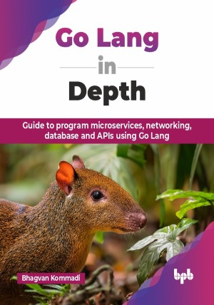

# Go Lang in Depth

Guide to program microservices, networking, database and APIs using Go Lang.

This is the repository for [Go Lang in Depth
](https://bpbonline.com/products/go-lang-in-depth?variant=44315712520392),published by BPB Publications.

## About the Book
Go, a modern and efficient programming language, is rapidly gaining popularity for building robust and scalable applications. This book, Go Lang in Depth, instills you with the knowledge and skills to master Go, from its fundamental building blocks to advanced concepts.

This Go programming book provides a detailed guide, starting from basic syntax and data structures to advanced concepts like concurrency and error handling. It teaches you how to build applications, including console apps, REST APIs, and web apps using popular frameworks like Gin and Beego. You will also explore creating real-world projects, such as a CRM system, and understand advanced topics like dependency injection, SOLID principles, and Docker containerization. The book covers performance optimization with profiling and benchmarking, ensures application security with authentication and cryptography, and explains design patterns and best practices for building scalable, secure web applications.

By the end of this book, you will be equipped to write clean, concurrent, and performant Go code. You will understand how to design and implement complex functionalities, leverage Go's powerful features effectively, and tackle real-world programming challenges.

## What You Will Learn
• Practical approach with hands-on exercises, real-world examples, and practical projects.

• Gain a thorough understanding of Go's core concepts, including concurrency, error handling, and testing.

• Learn to containerize Go applications with Docker and deploy them to production environments.

• Implement security measures and optimize the performance of your Go applications.
